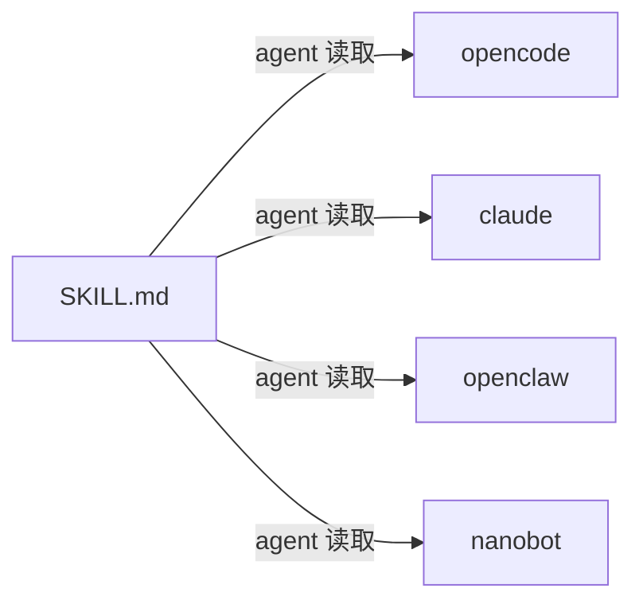

# llm-cli - LLM CLI Tool Architecture

## Overview

llm-cli 是一个面向 AI agent 的命令行图像工具，提供图像理解（vision）和图像生成（imagine）能力。采用 OpenAI 兼容 API 协议，可接入多个 provider。

### 设计原则

**Agent 各司其职：**
- Agent 自身的 LLM → 处理文本推理、代码生成
- llm-cli → 处理图像理解、图像生成

llm-cli 不替代 agent 的驱动模型，只补齐 agent 的多模态能力缺口。agent 通过 shell 调用 llm-cli，输出通过 stdout 返回给 agent 消费。

### 跨 Agent 生态

llm-cli 以标准 CLI 命令的形式暴露能力，配合 `SKILL.md` 文档，可被 opencode、claude code、openclaw、nanobot 等任何能执行 shell 命令的 agent 使用。不依赖特定 agent 的插件机制。

## Development Convention

### Commit 策略
- 每个原子任务完成后立即提交
- 提交粒度：一个功能模块一次提交
- 提交信息用英文，格式：`type: short description`

### 阶段边界
- 严格遵守当前版本的开发范围，不做超前功能
- 如果在当前阶段提交前提出超出范围的需求，助手应提醒"将在后续版本中实现"

## Tech Stack

| Layer | Technology |
|-------|-----------|
| Language | Rust (edition 2021) |
| CLI Framework | clap (derive) |
| HTTP Client | reqwest |
| Async Runtime | tokio |
| Serialization | serde + serde_json |
| Config Format | TOML |
| Error Handling | anyhow |

---

## Directory Structure

```
llm-cli/
├── SKILL.md             # Agent skill 文档（跨 agent 通用）
├── install.sh           # Binary 安装脚本（检测 OS → 下载 → ~/.local/bin/）
├── Cargo.toml
├── .github/
│   └── workflows/
│       └── release.yml  # CI: 构建静态 binary + GitHub Releases
└── src/
    ├── main.rs          # Entry point, command dispatch
    ├── cli.rs           # CLI argument definitions (clap derive)
    ├── config.rs        # TOML config file management (~/.config/llm-cli/config.toml)
    ├── provider.rs      # OpenAI-compatible API client
    └── types.rs         # Shared request/response types
```

---

## Architecture

### Agent 集成层

```
┌──────────────────────────────────────────────┐
│  Agent (opencode / claude / openclaw / ...)   │
│  ┌──────────────┐  ┌──────────────────────┐  │
│  │ 文本推理/代码  │  │ 读 SKILL.md 发现能力  │  │
│  │ (agent 自身)   │  │ 调用: llm-cli vision │  │
│  └──────────────┘  │       llm-cli imagine │  │
│                    └──────────┬───────────┘  │
└───────────────────────────────┼──────────────┘
                                │ command
                                ▼
┌─────────────────────────────────────────────┐
│  llm-cli (CLI)                               │
│                                              │
│  ┌──────────┐  ┌────────────┐                │
│  │ vision   │  │ imagine    │                │
│  │ 图像理解  │  │ 图像生成    │                │
│  └────┬─────┘  └──────┬─────┘                │
│       │               │                      │
│  ┌────▼───────────────▼────────────────────┐ │
│  │          Provider (OpenAI Client)        │ │
│  │  ┌──────────┐  ┌──────────────────┐     │ │
│  │  │ vision() │  │ imagine()        │     │ │
│  │  └────┬─────┘  └───────┬──────────┘     │ │
│  └───────┼────────────────┼────────────────┘ │
└──────────┼────────────────┼──────────────────┘
           │                │
           ▼                ▼
    OpenAI Chat API    DALL-E / 百炼
   (vision 多模态)      (image generation)
```

### 自举安装流程

```
agent 需要处理图片
  → 执行: llm-cli vision "描述" photo.jpg
  → shell: command not found: llm-cli
  → agent 读 SKILL.md 找到安装方法
  → 执行: curl -sfL https://.../install.sh | sh
  → 重试: llm-cli vision "描述" photo.jpg
  → 成功
```

agent 不需要预装任何东西，第一次调用失败后自行恢复。

---

## API Design

### Chat (文本生成)

```
POST /v1/chat/completions
  Request:
  {
    "model": "gpt-4o-mini",
    "messages": [
      { "role": "system", "content": [{ "type": "text", "text": "..." }] },
      { "role": "user", "content": [{ "type": "text", "text": "..." }] }
    ],
    "temperature": 0.7,
    "max_tokens": 2048
  }
  Response:
  {
    "choices": [{ "message": { "content": "..." } }],
    "usage": { "prompt_tokens": 10, "completion_tokens": 20, "total_tokens": 30 }
  }
```

### Vision (图像理解)

```
POST /v1/chat/completions
  Request:
  {
    "model": "gpt-4o",
    "messages": [{
      "role": "user",
      "content": [
        { "type": "text", "text": "描述这张图片" },
        { "type": "image_url", "image_url": { "url": "data:image/jpeg;base64,..." } }
      ]
    }]
  }
```

### Image Generation (图像生成)

```
POST /v1/images/generations
  Request:
  {
    "model": "dall-e-3",
    "prompt": "a cat wearing a hat",
    "n": 1,
    "size": "1024x1024"
  }
  Response:
  {
    "data": [{ "url": "https://..." }]
  }
```

---

## Data Flow

```
User Input (CLI arguments)
     │
     ▼
clap parse → cli::Commands
     │
     ├── Commands::Chat
     │    ├── config::load() → Config
     │    ├── Provider::chat(model, system, messages, temperature, max_tokens)
     │    │    └── POST /v1/chat/completions → OpenAI API
     │    └── Print response + token usage
     │
     ├── Commands::Vision
     │    ├── config::load() → Config
     │    ├── Read image files → base64 encode
     │    ├── Provider::vision(model, text, images, ...)
     │    │    └── POST /v1/chat/completions (multi-part content) → OpenAI API
     │    └── Print response + token usage
     │
     ├── Commands::Imagine
     │    ├── config::load() → Config
     │    ├── Provider::imagine(model, prompt, n, size)
     │    │    └── POST /v1/images/generations → DALL-E API
     │    └── Print image URL(s)
     │
     └── Commands::Config
          ├── config::show() → Print current config
          └── config::set(key, value) → Update + persist TOML
```

---

## Skill 系统

### 文件结构

`SKILL.md` 是跨 agent 通用的 skill 文档，不绑定任何 agent 特定路径。agent 自行决定如何注册到其 skill 目录。



### 前置条件声明

SKILL.md 只做一件事：**告诉 agent 这个工具需要什么、怎么装、怎么用**。agent 在调用失败时从文档中获取安装指令进行恢复。

```
agent 调用 llm-cli → command not found → 读 SKILL.md → 执行 install.sh → 重试
```

### 不做什么

- 不写 agent 注册方式（agent 自己知道怎么装 skill）
- 不枚举 agent 目录路径
- 不包含任何 agent 特定的配置格式

---

## Usage

### 初始化配置

```bash
# 首次使用需要设置 API Key
llm-cli config set api_key "sk-xxx"

# 查看当前配置
llm-cli config show

# 切换 Provider（以百炼为例）
llm-cli config set api_base "https://dashscope.aliyuncs.com/compatible-mode/v1"
llm-cli config set model "qwen-plus"
llm-cli config set vision_model "qwen-vl-plus"
llm-cli config set image_model "qwen-image-2.0-pro"

# 百炼图像生成需要额外设置 multimodal-generation 端点
llm-cli config set dashscope_endpoint "https://dashscope.aliyuncs.com/api/v1/services/aigc/multimodal-generation/generation"
```

### chat — 文本生成

```bash
# 简单对话
llm-cli chat "你好"

# 带 system prompt
llm-cli chat "解释什么是Rust" --system "你是一个Rust专家"

# 覆盖模型和参数
llm-cli chat "写一首诗" --model gpt-4o --temperature 0.8 --max-tokens 500
```

参数：
| 参数 | 说明 |
|------|------|
| `<message>` | 发送的消息（必填） |
| `--model` | 模型名，覆盖配置文件中的 `model` |
| `--system` | 系统提示词 |
| `--temperature` | 温度值 (0.0–2.0) |
| `--max-tokens` | 最大输出 token 数 |

### vision — 图像理解

```bash
# 单图分析
llm-cli vision "描述这张图片" photo.jpg

# 多图分析
llm-cli vision "这些图片有什么共同点" photo1.jpg photo2.png

# 指定模型
llm-cli vision "图中是什么？" img.jpg --model qwen-vl-plus
```

参数：
| 参数 | 说明 |
|------|------|
| `<prompt>` | 文本提示词（必填） |
| `<images>` | 图片路径，支持多个（必填至少一个） |
| `--model` | 模型名，覆盖配置文件中的 `vision_model` |
| `--system` | 系统提示词 |
| `--temperature` | 温度值 (0.0–2.0) |
| `--max-tokens` | 最大输出 token 数 |

支持格式：jpg / jpeg / png / gif / webp，自动 base64 编码后发送。

### imagine — 图像生成

```bash
# 文生图
llm-cli imagine "一只戴帽子的猫"

# 指定数量、尺寸
llm-cli imagine "赛博朋克城市" --n 2 --size 1024x1024

# 指定模型
llm-cli imagine "水墨风格山水" --model dall-e-3
```

参数：
| 参数 | 说明 |
|------|------|
| `<prompt>` | 图像描述（必填） |
| `--model` | 模型名，覆盖配置文件中的 `image_model` |
| `--n` | 生成数量（默认 1） |
| `--size` | 图像尺寸，如 `1024x1024`、`1792x1024` |

**Provider 适配说明：**
- OpenAI 兼容（默认）：使用 `api_base` + `image_api_path`（默认 `/images/generations`）
- 百炼 Dashscope：需额外设置 `dashscope_endpoint`，启用后自动切换为 multimodal-generation 接口

---

## Development Philosophy

优先构建最小可用原型，再基于原型逐步添加功能。每一步都产出可运行的版本，确保核心链路始终通畅。

```
v0.1 Chat ──▶ v0.2 Vision + Imagine ──▶ v0.3 Agent Skill
```

每个版本都独立可用，互不阻塞。

---

## Development Phases

### v0.1 — CLI 骨架 + 文本生成 (Minimal Chat)

目标：跑通全链路 —— 用户在终端输入消息，LLM 回复。

#### 1a. 项目初始化
- [x] 初始化 Rust 项目，引入 clap + reqwest + tokio + serde + anyhow
- [x] `config` 模块：TOML 配置文件读写 (`~/.config/llm-cli/config.toml`)
- [x] `cli` 模块：clap derive 解析 `chat` / `vision` / `imagine` / `config` 子命令
- [x] `provider` 模块：基于 `reqwest` 的 OpenAI 兼容 API 客户端
- [x] `types` 模块：请求/响应的 serde 类型定义
- [x] `config set/show` 配置管理命令

#### 1b. 文本生成
- [x] `llm-cli chat <message>` 对话补全
- [x] 支持 `--model` / `--system` / `--temperature` / `--max-tokens` 参数
- [x] Token 用量统计输出到 stderr

> 交付物：一个能聊天的 CLI 工具。

---

### v0.2 — 图像理解 + 图像生成

目标：支持多模态能力。

#### 2a. 图像理解 (Vision)
- [x] `llm-cli vision <prompt> <images...>` 分析图片
- [x] 本地图片自动读取并 base64 编码
- [x] 支持 jpg / png / gif / webp 格式
- [x] 多图同时分析

#### 2b. 图像生成 (Imagine)
- [x] `llm-cli imagine <prompt>` 生成图片
- [x] 支持 `--model` / `--n` / `--size` 参数
- [x] 输出图片 URL

> 交付物：支持多模态的 CLI 工具。

---

### v0.3 — Agent Skill 集成

目标：让 llm-cli 能被任意 agent 发现和使用。

- [x] `SKILL.md` — agent skill 文档（能力描述、用法、前置条件）
- [x] `install.sh` — 二进制自举安装脚本
- [ ] `.github/workflows/release.yml` — CI 构建多平台静态 binary
- [ ] GitHub Releases 自动发布
- [ ] 跨平台测试（Linux musl / macOS arm64 / macOS x86_64）

---

## Dependencies

```toml
[dependencies]
clap = { version = "4", features = ["derive"] }
reqwest = { version = "0.12", features = ["json"] }
tokio = { version = "1", features = ["full"] }
serde = { version = "1", features = ["derive"] }
serde_json = "1"
anyhow = "1"
base64 = "0.22"
toml = "0.8"
```
